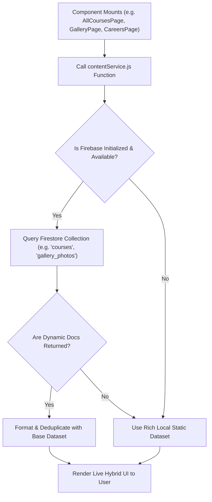
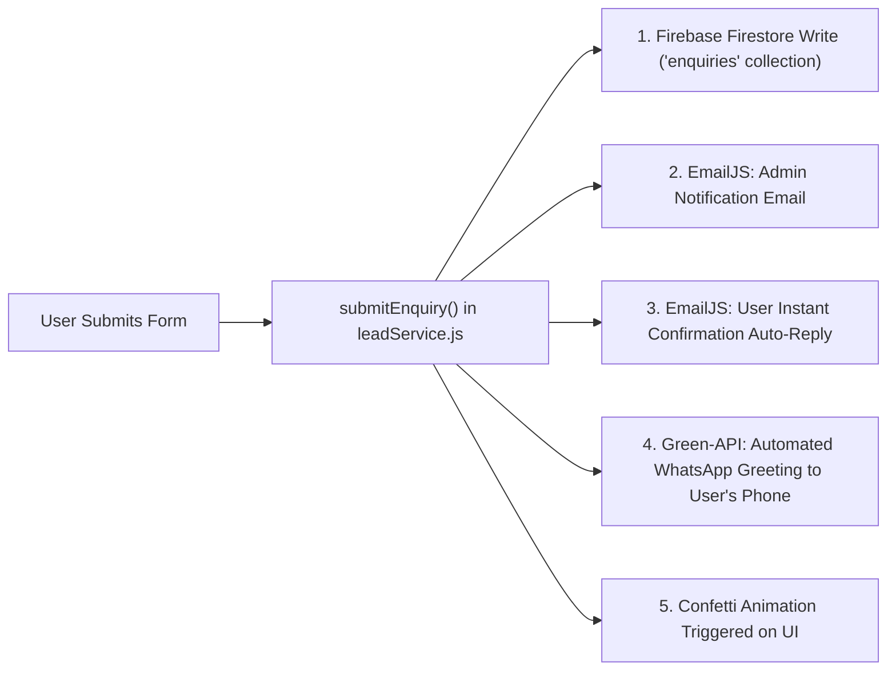

# Yukti Software — Official Project & Technical Documentation

> **Complete Architecture, Firebase Integration, Dynamic Data Engine, Admin Management & Deployment Guide**
>
> *Author:* Engineering & Tech Team  
> *Version:* 2.0.0 (Production Enterprise Edition)  
> *Target Architecture:* React 18 + Vite + Tailwind CSS + Firebase Firestore + Unified Multi-Channel Lead Engine

---

## 📑 Table of Contents

1. [Executive Summary & Tech Stack](#1-executive-summary--tech-stack)
2. [Project Architecture & Directory Structure](#2-project-architecture--directory-structure)
3. [How the Website is Built (Design System & Core Mechanics)](#3-how-the-website-is-built)
4. [Dynamic Data System (How Components Load & Merge Dynamic Data)](#4-dynamic-data-system)
5. [Firebase Integration & Backend Architecture](#5-firebase-integration--backend-architecture)
6. [Unified Multi-Channel Lead Engine (Enquiry / Forms / WhatsApp / Email)](#6-unified-multi-channel-lead-engine)
7. [Admin Portal & Content Management Architecture](#7-admin-portal--content-management)
8. [SEO & Canonical SPA Routing Engine](#8-seo--canonical-spa-routing-engine)
9. [How to Start, Run, Build & Deploy](#9-how-to-start-run-build--deploy)
10. [Troubleshooting & Best Practices](#10-troubleshooting--best-practices)

---

## 1. Executive Summary & Tech Stack

Yukti Software's web platform is an enterprise-grade Single Page Application (SPA) designed to serve as both an **IT Software Solutions Showcase** and an **Accredited Software Training Institute Portal** based in Greater Noida. 

### Core Technologies

| Layer | Technology | Purpose |
|---|---|---|
| **Frontend Framework** | **React 18.3.1** | Component-driven UI, Suspense lazy-loading, state-driven SPA navigation |
| **Build & Dev Tool** | **Vite 5.4.14** | Lightning-fast HMR dev server and optimized Rollup production bundling |
| **Styling & Design** | **Tailwind CSS 3.4.17** + PostCSS + Autoprefixer | Utility-first responsive design, dark/light theme switching, glassmorphism |
| **Database & Cloud Backend** | **Firebase Firestore (v12.19.0)** | Serverless real-time NoSQL database for leads, courses, internships, gallery, team |
| **Email Dispatch** | **EmailJS Browser SDK (^4.4.1)** | Client-side dual email dispatch: Admin notification + User instant confirmation |
| **WhatsApp Automation** | **Green-API Gateway / WhatsApp Direct** | Instant automated WhatsApp greeting & batch details dispatch to user's mobile |
| **Icons & Media** | **Lucide React (^0.344.0)** | Crisp, modern SVG icons for all tech stacks and navigation |
| **Micro-Interactions** | **Canvas Confetti (^1.9.4)** | Visual celebrations upon lead and internship application submissions |

---

## 2. Project Architecture & Directory Structure

```text
yukti-main-website/
├── public/
│   ├── images/                 # Static gallery, hero, and team assets
│   ├── robots.txt              # Search engine crawling rules
│   ├── sitemap.xml             # XML Sitemap with all canonical SEO slugs
│   ├── _redirects              # SPA rewrite rule (/* /index.html 200) for Netlify/Cloudflare
│   └── yukti-logo.svg          # Official brand vector logo
├── src/
│   ├── assets/                 # Optimized images, logos, and gallery media
│   │   ├── Gallery/            # Campus photos, labs, workshop snapshots
│   │   ├── Team/               # Faculty and leadership portrait assets
│   │   └── yukti-logo.svg
│   ├── components/             # Reusable UI Blocks & Widgets
│   │   ├── BrandPreloader.jsx      # Initial brand loading animation
│   │   ├── ConsultationModal.jsx   # Multi-step consultation & enrollment modal
│   │   ├── ContactForm.jsx         # Homepage bottom contact & lead form
│   │   ├── FloatingHelpBar.jsx     # Floating WhatsApp & quick call action bar
│   │   ├── Footer.jsx              # Comprehensive footer with SEO course links
│   │   ├── FounderMessage.jsx      # Leadership statement & corporate assurances
│   │   ├── GoogleReviewsWidget.jsx # Live rating display & student reviews
│   │   ├── Hero.jsx                # Responsive hero section with CTA buttons
│   │   ├── MissionVision.jsx       # Corporate mission, vision & values
│   │   ├── Navbar.jsx              # Responsive header with desktop/mobile navigation
│   │   ├── NavbarCoursesDropdown.jsx # 16-course mega menu with category filters
│   │   ├── PageSkeletonLoader.jsx  # Fallback skeleton screen while sub-pages load
│   │   ├── Promises.jsx            # Student assurances & enterprise SLAs
│   │   ├── Roadmap.jsx             # Project delivery & student learning roadmap
│   │   ├── ScrollProgressBar.jsx   # Top window scroll progress indicator
│   │   ├── Services.jsx            # Enterprise software engineering services
│   │   ├── SocialIcons.jsx         # Vector social links (WhatsApp, LinkedIn, etc.)
│   │   ├── StatsHighlights.jsx     # Animated counting statistics & achievements
│   │   ├── StructuredData.jsx      # Schema.org JSON-LD structured metadata
│   │   ├── Team.jsx                # Faculty & mentor showcase with filter tabs
│   │   ├── TechLogos.jsx           # SVG logos for Java, Python, React, Spring, etc.
│   │   └── TrainingCourses.jsx     # Homepage courses grid with live preview
│   ├── context/
│   │   └── ThemeContext.jsx        # Global Dark / Light theme context provider
│   ├── data/
│   │   ├── courseImages.js         # Dedicated photo galleries per course
│   │   ├── coursesCatalog.js       # Complete 16+ course definitions & metadata
│   │   └── pagesDataFromDocs.js    # Syllabus, modules, FAQs, and DOCX data
│   ├── hooks/
│   │   ├── useCountUp.js           # Animated number counter for statistics
│   │   ├── useGoogleReviews.js     # Dynamic reviews provider with fallback
│   │   └── useInView.js            # IntersectionObserver hook for viewport animations
│   ├── pages/                      # Lazy-Loaded Top-Level Views
│   │   ├── AboutPage.jsx           # Corporate profile, founder letter, team
│   │   ├── AllCoursesPage.jsx      # 16-course master catalog with search & filters
│   │   ├── CareersPage.jsx         # Live internship openings & direct application
│   │   ├── CourseDetailPage.jsx    # Dynamic course detail (curriculum, syllabus, FAQs)
│   │   ├── GalleryPage.jsx         # Campus photos & video testimonials
│   │   ├── InternshipPage.jsx      # Specialized internship landing view
│   │   └── TrainingInstitutePage.jsx # Accredited institute landing & accreditations
│   ├── services/
│   │   ├── contentService.js       # Firebase Firestore dynamic content loader & merger
│   │   └── leadService.js          # Firestore lead saver, EmailJS & WhatsApp gateway
│   ├── utils/
│   │   └── routeUtils.js           # Canonical SEO slug router & browser history sync
│   ├── App.jsx                     # Root component, state-based router & modal host
│   ├── data.js                     # Global site branding, contacts, social media
│   ├── firebase.js                 # Firebase App and Firestore safe initialization
│   ├── index.css                   # Tailwind directives, custom glassmorphism & fonts
│   └── main.jsx                    # React DOM entrypoint
├── index.html                      # Root HTML with SEO meta tags & fonts
├── package.json                    # Dependencies and scripts
├── tailwind.config.js              # Theme colors, fonts, and animation keyframes
└── vite.config.js                  # Vite configuration and chunk optimization
```

---

## 3. How the Website is Built

### 3.1 Architecture Overview
The platform follows a **Clean Component-Driven Single Page Application (SPA)** architecture without heavy server dependencies. 

- **Performance-First Code Splitting**: Sub-pages (`AboutPage`, `AllCoursesPage`, `CourseDetailPage`, `GalleryPage`, `CareersPage`, `TrainingInstitutePage`) are loaded asynchronously via `React.lazy()` and wrapped in `<Suspense fallback={<PageSkeletonLoader />}>`. This keeps the initial homepage bundle minimal and ensures sub-second page loads.
- **Global Theme Engine**: `ThemeContext.jsx` manages `dark` / `light` mode across the DOM, storing the user's preference in `localStorage` and applying Tailwind's `class="dark"` attribute on the root `<html>`.
- **Micro-Animations & Visuals**: Viewport-triggered animations are driven by custom hooks (`useInView`, `useCountUp`) and CSS keyframes (`shimmer`, `fadeIn`, `slideUp`), complemented by `canvas-confetti` on successful form submissions.

---

## 4. Dynamic Data System

### 4.1 The Hybrid Data Strategy (Firestore + Fallback Matrix)
A standout feature of the codebase is its **Fail-Safe Dynamic Data Engine**. The website will never show blank screens or crash if Firestore is unreachable, unconfigured, or experiencing latency.



### 4.2 How Each Component Renders Dynamic Data

#### 1. Courses Catalog (`AllCoursesPage.jsx` & `TrainingCourses.jsx`)
- **Data Source**: `contentService.getCourses(MASTER_COURSES)`
- **Mechanism**:
  1. Queries Firestore `courses` (or fallback `custom_courses`) sorted by `createdAt desc`.
  2. If new courses are added via Admin, they are prepended dynamically.
  3. Deduplicates against `MASTER_COURSES` by slug/title so static and dynamic courses co-exist seamlessly.
  4. Supports dynamic search filtering and category tab switching (`Full Stack`, `Programming`, `AI & Data`, `Databases`).

#### 2. Course Detail Page (`CourseDetailPage.jsx`)
- **Data Source**: Dynamic route parameter `courseKey` resolved through `routeUtils.js` + `docxPagesData.courses[courseKey]` + `courseImages.js`.
- **Mechanism**:
  - Dynamically renders syllabus modules with expandable accordions (`openModuleIndex`).
  - Renders photo carousels from `courseImages.js` specific to that tech stack.
  - Generates key highlights, FAQs, duration badges, and batch booking forms specific to the selected course.
  - Updates browser `document.title` and canonical URLs dynamically.

#### 3. Careers & Internship Page (`CareersPage.jsx`)
- **Data Source**: `contentService.getInternshipRoles(INTERNSHIP_ROLES)`
- **Mechanism**:
  - Fetches live openings from Firestore collections `internship_roles`, `internships`, or `careers`.
  - Displays dynamic badges (`UI / Web Track`, `APIs & Databases`, `End-to-End MERN`).
  - Clicking **"Apply Now"** opens a modal pre-filled with the selected role name.

#### 4. Photo & Video Gallery (`GalleryPage.jsx`)
- **Data Source**: `contentService.getGalleryPhotos(PHOTO_ITEMS)` & `contentService.getGalleryVideos(VIDEO_ITEMS)`
- **Mechanism**:
  - Merges Firestore `gallery_photos` and `gallery_videos` with 15+ local high-resolution assets.
  - Provides category filtering (`College Collaborations`, `Industrial Internships`, `Labs & Classrooms`, `Events & Workshops`).
  - Includes a full-screen image and video player modal with keyboard `ESC` dismissal.

#### 5. Faculty & Team (`Team.jsx`)
- **Data Source**: `contentService.getTeamMembers(BASE_TEAM_MEMBERS)`
- **Mechanism**:
  - Fetches custom mentors from Firestore `team_members` or `team`.
  - Dynamically calculates initials, gradient badges, experience metrics, and tech specialties.

---

## 5. Firebase Integration & Backend Architecture

### 5.1 Safe Initialization (`src/firebase.js`)
Firebase is initialized with defensive guards so missing `.env` keys log a gentle console warning without stopping the frontend build or runtime:

```javascript
import { initializeApp, getApps, getApp } from 'firebase/app';
import { getFirestore } from 'firebase/firestore';

const firebaseConfig = {
  apiKey: import.meta.env.VITE_FIREBASE_API_KEY,
  authDomain: import.meta.env.VITE_FIREBASE_AUTH_DOMAIN,
  projectId: import.meta.env.VITE_FIREBASE_PROJECT_ID,
  storageBucket: import.meta.env.VITE_FIREBASE_STORAGE_BUCKET,
  messagingSenderId: import.meta.env.VITE_FIREBASE_MESSAGING_SENDER_ID,
  appId: import.meta.env.VITE_FIREBASE_APP_ID
};

let app = null;
let db = null;

try {
  if (firebaseConfig.apiKey && firebaseConfig.projectId) {
    app = getApps().length === 0 ? initializeApp(firebaseConfig) : getApp();
    db = getFirestore(app);
  }
} catch (error) {
  console.error('[Firebase] Initialization error:', error);
}

export { app, db };
```

### 5.2 Firestore Database Schema (Collections Reference)

#### 1. `enquiries` Collection (All Leads & Registrations)
```json
{
  "id": "auto_generated_doc_id",
  "name": "Aarav Sharma",
  "email": "aarav.sharma@gmail.com",
  "phone": "9876543210",
  "type": "course_enquiry",
  "course": "Java Full Stack Development",
  "service": "",
  "mode": "Classroom Greater Noida",
  "message": "Interested in weekend batch with placement assistance",
  "status": "new",
  "sourceUrl": "https://yuktisoftware.com/java-full-stack-course-greater-noida/",
  "submittedAt": "2026-10-03T13:45:00.000Z",
  "serverTimestamp": "Firestore Timestamp"
}
```

#### 2. `courses` / `custom_courses` Collection (Dynamic Courses)
```json
{
  "id": "course-cloud-devops",
  "key": "cloud-devops",
  "title": "AWS & DevOps Engineering Masterclass",
  "category": "programming",
  "badge": "Hot Technology",
  "duration": "4 - 5 Months",
  "color": "from-amber-500 to-orange-600",
  "description": "Master Docker, Kubernetes, CI/CD pipelines, Terraform, and AWS cloud architectures.",
  "highlights": ["Docker & Kubernetes", "Jenkins & GitHub Actions", "Terraform IaC", "AWS SysOps"],
  "modulesCount": 10,
  "createdAt": "2026-10-03T10:00:00.000Z"
}
```

#### 3. `internship_roles` Collection (Careers / Internships)
```json
{
  "id": "role-ai-intern",
  "title": "4. Generative AI & LLM Intern",
  "tagline": "Build production LLM agents, RAG workflows, and modern API integrations.",
  "department": "Artificial Intelligence",
  "badge": "High Demand",
  "keyFocus": [
    "Fine-tuning open-source LLMs with LangChain and LlamaIndex.",
    "Developing vector database pipelines with Pinecone and ChromaDB.",
    "Integrating AI microservices into React.js frontends."
  ],
  "technologies": ["Python", "LangChain", "FastAPI", "OpenAI", "Vector DBs"],
  "description": "Work directly with our senior AI engineers building client solutions.",
  "createdAt": "2026-10-03T10:00:00.000Z"
}
```

#### 4. `gallery_photos` / `gallery_videos` Collection
```json
{
  "id": "photo-hackathon-2026",
  "title": "Greater Noida Inter-College Hackathon 2026",
  "category": "workshops",
  "categoryLabel": "Events & Workshops",
  "caption": "Yukti Software hosted 150+ student developers for 24-hour coding marathon.",
  "image": "https://images.unsplash.com/photo-1531482615713-2afd69097998",
  "badge": "Hackathon 2026",
  "createdAt": "2026-10-03T10:00:00.000Z"
}
```

---

## 6. Unified Multi-Channel Lead Engine

Every form across the site (`ConsultationModal`, `ContactForm`, `CourseDetailPage` batch form, `CareersPage` application modal) dispatches through `src/services/leadService.js`.



### Key Capabilities:
1. **Firestore Persistence**: Instant record creation with `serverTimestamp()`.
2. **Admin Email Alert**: Email sent to `contact@yuktisoftware.com` with lead's name, phone, course interest, mode, and referrer URL.
3. **User Auto-Reply**: Branded confirmation email sent to the user thanking them for contacting Yukti Software.
4. **WhatsApp Automation**: If configured (`VITE_GREEN_API_ID_INSTANCE`), a WhatsApp message is sent to the candidate with helpline numbers and website links.
5. **WhatsApp 1-Click Fallback**: `getWhatsAppDirectUrl()` formats Indian (`+91`) and international numbers for direct browser WhatsApp chats.

---

## 7. Admin Portal & Content Management

The platform supports direct Firebase content operations and an admin architecture designed to manage leads and dynamic site data with ease.

### 7.1 Admin Portal Features & Theme
- **Consistent Light Theme Design**: Modern, clean white and slate UI matching the main website aesthetic (slate-50 background, indigo/brand accent buttons, subtle borders).
- **Lead Management Dashboard**:
  - View all inbound enquiries from `enquiries` Firestore collection in real-time.
  - Filter by `type` (`course_enquiry`, `demo_booking`, `career_apply`, `contact`), `status` (`new`, `contacted`, `converted`), or `date`.
  - 1-click WhatsApp chat and direct phone dialing buttons for admissions counsellors.
- **Dynamic Course Creator**:
  - Add new courses with modules, duration, highlights, and custom badge tags that immediately reflect in `AllCoursesPage` and dropdowns.
- **Internship Role Publisher**:
  - Post new internship opportunities that automatically appear on `CareersPage` and `InternshipPage`.
- **Gallery Uploader**:
  - Add photo URLs, video links, titles, and category tags to keep the campus gallery up-to-date.

---

## 8. SEO & Canonical SPA Routing Engine

### 8.1 The SEO URL Problem in SPAs
Traditional React SPAs either use hash routing (`/#/course-python`) or generic paths (`/course?id=python`), which harm Google indexing and local SEO rankings in Greater Noida.

### 8.2 Canonical Route Resolution (`src/utils/routeUtils.js`)
This project maps **every primary keyword** to its exact SEO slug:

```javascript
export const CANONICAL_ROUTES = {
  home: '/',
  about: '/about-us/',
  careers: '/carrer-page/',
  gallery: '/gallery/',
  courses: '/courses/',
  'training-institute': '/software-training-institute-greater-noida/',

  // 19+ Master Courses from Official SEO Blueprint
  'course-python': '/python-training-institute-greater-noida/',
  'course-java': '/java-training-institute-greater-noida/',
  'course-advanced-java': '/advanced-java-training-institute-greater-noida/',
  'course-dsa': '/dsa-course-greater-noida/',
  'course-java-fullstack': '/java-full-stack-course-greater-noida/',
  'course-python-fullstack': '/python-full-stack-course-greater-noida/',
  'course-mern-stack': '/mern-stack-training-institute-greater-noida/',
  'course-fullstack': '/full-stack-development-course-greater-noida/',
  'course-data-analytics': '/data-analytics-course-greater-noida/',
  'course-ai-ml': '/ai-and-machine-learning-course-greater-noida/',
  'course-html-css': '/html-and-css-course-greater-noida/',
  'course-ai-fullstack': '/ai-full-stack-development-in-greater-noida/',
  'course-react-js': '/react-js-training-institute-in-greater-noida/',
  'course-dbms': '/database-management-system-course-greater-noida/',
  'course-dbms-institute': '/database-management-system-institute-greater-noida/',
  'course-sql': '/sql-training-institute-in-greater-noida/',
  'course-nosql': '/nosql-database-course-greater-noida/',
  'course-spring-boot': '/spring-boot-training-course-in-greater-noida/',
  'course-software-development': '/software-training-course-greater-noida/'
};
```

### 8.3 Browser URL Synchronization
- **`pushPageUrl(pageKey, hash)`**: Updates `window.location.pathname` via `window.history.pushState` on every click without reloading the browser.
- **`window.addEventListener('popstate')`**: Listens for browser **Back** / **Forward** buttons and automatically re-renders the correct view.
- **Direct URL Loads & Refreshes**: On page refresh (e.g. landing on `/python-training-institute-greater-noida/`), `getPageKeyFromPath()` parses the URL and renders the Python course directly.

---

## 9. How to Start, Run, Build & Deploy

### 9.1 Prerequisites
- **Node.js**: `v18.0.0` or higher (Recommended: `v20.x LTS`)
- **Package Manager**: `npm` (v9+) or `yarn` / `pnpm`

### 9.2 Environment Configuration (`.env`)
Create a `.env` file in the root directory:

```ini
# ==========================================
# 1. FIREBASE CONFIGURATION (Firestore)
# ==========================================
VITE_FIREBASE_API_KEY=your_firebase_api_key_here
VITE_FIREBASE_AUTH_DOMAIN=your_project_id.firebaseapp.com
VITE_FIREBASE_PROJECT_ID=your_project_id
VITE_FIREBASE_STORAGE_BUCKET=your_project_id.appspot.com
VITE_FIREBASE_MESSAGING_SENDER_ID=your_sender_id
VITE_FIREBASE_APP_ID=your_app_id

# ==========================================
# 2. EMAILJS CONFIGURATION (Lead Alerts)
# ==========================================
VITE_EMAILJS_SERVICE_ID=your_service_id
VITE_EMAILJS_PUBLIC_KEY=your_public_key
VITE_EMAILJS_ADMIN_TEMPLATE_ID=your_admin_notification_template_id
VITE_EMAILJS_USER_TEMPLATE_ID=your_user_auto_reply_template_id

# ==========================================
# 3. GREEN-API WHATSAPP GATEWAY (Optional)
# ==========================================
VITE_GREEN_API_ID_INSTANCE=your_green_api_instance_id
VITE_GREEN_API_TOKEN_INSTANCE=your_green_api_token
```

### 9.3 Installation & Local Development

```bash
# 1. Clone repository & enter directory
git clone https://github.com/HINDSINHA2005/Yukti_Software_Website.git
cd yukti-main-website

# 2. Install all dependencies
npm install

# 3. Start local development server
npm run dev
```

The application will be accessible at `http://localhost:5173/`.

### 9.4 Production Build & Testing

```bash
# Build production bundle into /dist folder
npm run build

# Preview production build locally
npm run preview
```

### 9.5 Production Deployment Options

#### Option A: Netlify / Cloudflare Pages / Vercel
The `public/_redirects` file is pre-configured with:
```text
/*    /index.html   200
```
This guarantees that direct page visits to `/about-us/` or `/java-training-institute-greater-noida/` resolve to `index.html` where our SPA routing resolves them cleanly.

#### Option B: Firebase Hosting
```bash
npm install -g firebase-tools
firebase login
firebase init hosting
# Set public directory to 'dist' and configure as single-page app (rewrite all URLs to /index.html)
npm run build
firebase deploy --only hosting
```

#### Option C: Apache / cPanel / Shared Hosting
Create or update `.htaccess` inside the web root:
```apache
<IfModule mod_rewrite.c>
  RewriteEngine On
  RewriteBase /
  RewriteRule ^index\.html$ - [L]
  RewriteCond %{REQUEST_FILENAME} !-f
  RewriteCond %{REQUEST_FILENAME} !-d
  RewriteRule . /index.html [L]
</IfModule>
```

---

## 10. Troubleshooting & Best Practices

1. **Firebase Fallback Mode Warning**: If you see `[Firebase] Credentials not configured yet in .env file`, ensure your `.env` keys start with the `VITE_` prefix so Vite exposes them to the client.
2. **Adding a New Course**: To add a new course permanently, either add it in Firestore `courses` collection or append it to `src/data/pagesDataFromDocs.js` and `CANONICAL_ROUTES` in `src/utils/routeUtils.js`.
3. **Form Submissions**: When testing locally without EmailJS / WhatsApp credentials, Firestore leads will still be recorded or logged cleanly to the developer console.

---

*© 2026 Yukti Software. All rights reserved. Built with precision for enterprise performance and high-ranking local SEO.*
